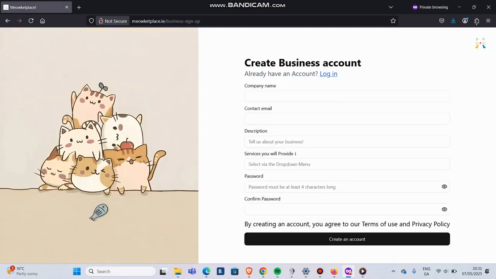
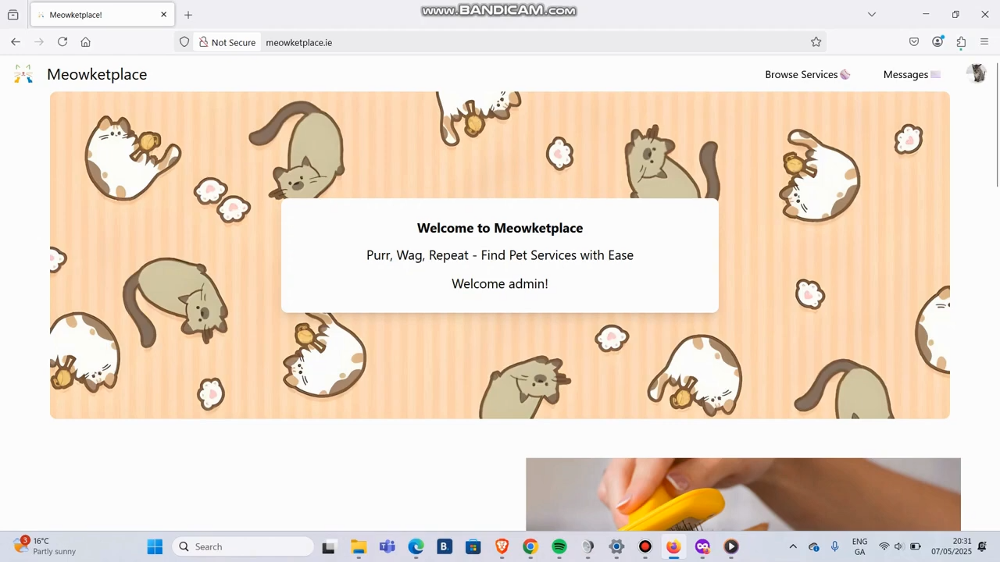
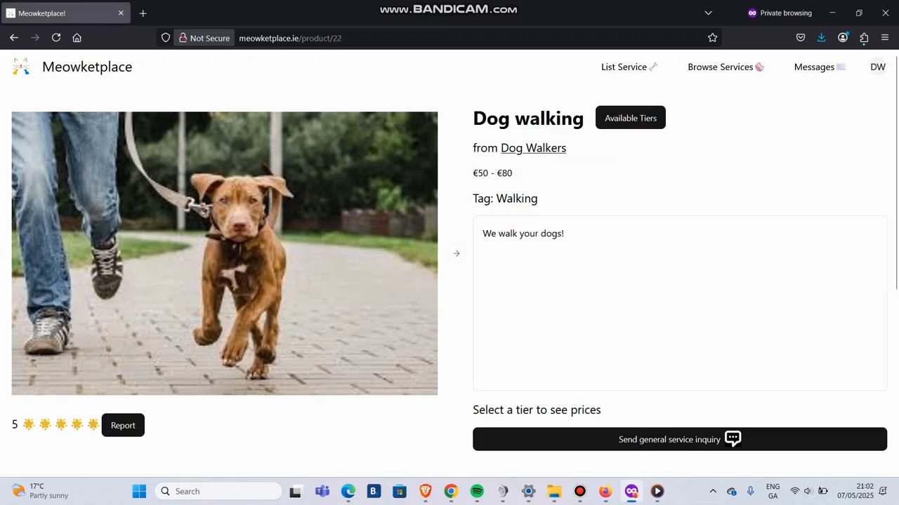
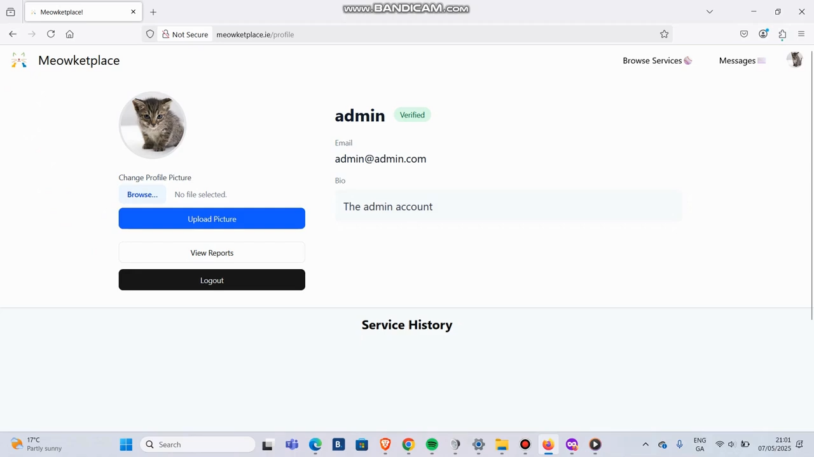
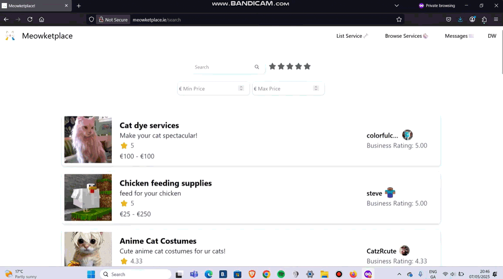

# Meowketplace – CS4116 Software Development Project

**Meowketplace** is a **business service marketplace** focused on pet-related services. Businesses can advertise their offerings, and users can connect, negotiate, and arrange services through the platform.  

The project was developed using **HTML, CSS, Bootstrap, PHP, and MySQL**.  

---

## Key Features

- **User & Business Accounts**:  
  - Business and regular users can create accounts with relevant information.  
  - Businesses provide company details, services, and pricing tiers.  
- **Service Listings & Pricing**:  
  - Businesses can post services/products with varying prices and tiers.  
  - Detailed descriptions included for each service.  
  - Businesses can advertise their listings.  
- **Service Inquiry & Messaging**:  
  - Users can express interest via a Service Inquiry.  
  - Businesses can accept or deny Service Inquiries.  
  - Messaging allows negotiation on pricing and service details.  
- **Verified Customer Reviews**:  
  - Only verified customers can leave reviews with a 1-5 star rating and comment.  
  - Businesses can respond to reviews.  
- **Search & Filtering**:  
  - Users can search for services/products using keywords.  
  - Filters available, e.g., price range and rating.  
  - Businesses are ranked by relevance and rating.  
- **Customer Insights**:  
  - Users can request permission to message Verified Customers about their experience.  
  - Messaging is enabled only after the recipient accepts the request.  
- **Administrative Controls**:  
  - Admins can ban users or businesses violating terms of service.  
  - Admins can remove inappropriate reviews or messages.  

---

## Development

- **Backend**: PHP  
- **Frontend**: HTML, CSS, Bootstrap, React  
- **Database**: MySQL / MariaDB  
- **Branch for Deployment**: `main` branch previously deployed at [meowketplace.ie](http://meowketplace.ie)  

---

## Project Deliverables

- User and Business Registration functionality  
- Service Listings with pricing tiers and descriptions  
- Service Inquiry and messaging system  
- Verified customer review system  
- Search and filtering functionality  
- Peer-to-peer communication for customer insights  
- Administrative tools for content moderation and user management  
- Source code, database setup, and documentation  

---

## Screenshots

**Registration Page**  
  

**Home Page / Marketplace Overview**  
  

**Service Listing Example**  
  

**Admin Dashboard**  
  

**Demo GIF**  

*Demonstrates search, sorting, and filtering of services, as well as messaging interactions.*
